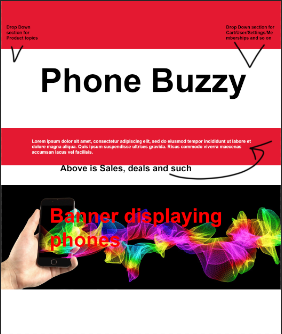

# Planned Design

## Colour Schemes

### Colour scheme one
+ 4e63ae - Calming colour that catches your attention to the content inside, and allows to ignore if not needed without annoyingly glowing to distract you

+ cdcdcd - Bright Grey is to compliment the other calm colours and not be glaringly painful works well as a background colour to let the content pop out

+ 424242 - Works well to blend in the background while popping out to give more attention to content inside

### Colour scheme two
+ #1e6dbc - Nice shade of blue and allows the search bar and other content to popout, easy to spot due to big colour difference

+ #ffffff - Looks professional and works well with other colours

+ #ced4da - Works great as a background colour for products

+ #2a3745 - a Blueish grey description/info box works well with the brighter blue top

### Design One

The Design seems simple, easy to navigate, has a good amount of information, loads fast, and seems engaging.

It looks professional, Performs well with minimal amount of bugs,
due to it being engaging, fast loading and easy to navigate, it should have high traffic in income
Due to the professional look it would reinforce the branding.

Code section has Notes which say what section is meant for what area,
Reasonably easy to maintain,
Easy to test, and has the potential to follow HTTPS standards, as mentioned before because its well organised and easy to maintain it can implement codes between the scripts quickly and easily
### Design Two

Due to this Design being too similar to the previous one i decided to attempt on making a new one

### Design Three

# Actual Design

## Chosen Colour
with some other colours in between

## Chosen Design
this is the foundation idea of the design

This design has been chosen as somewhat of a mix between my other ideas and proposes great navigation and understanding as well as aesthetic pleasure.

## Typography 
+ Brawler: Very simple and traditional looking, it was designed for comfortable reading in small sizes, the design concept was shaped by the demands of low quality media and the aesthetic preferences. size 14

+ Volkhov: Looks professional, simplistic and is intended for providing a motivating reading experience. size 14

