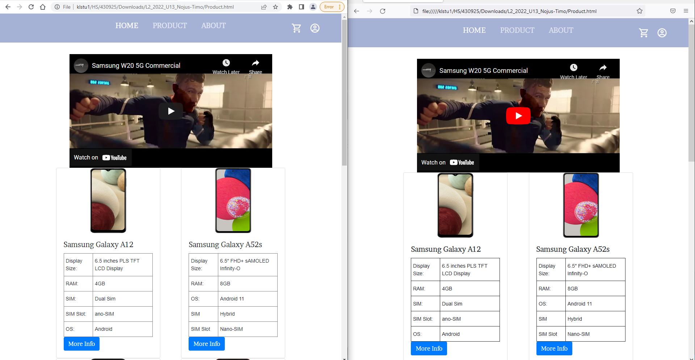
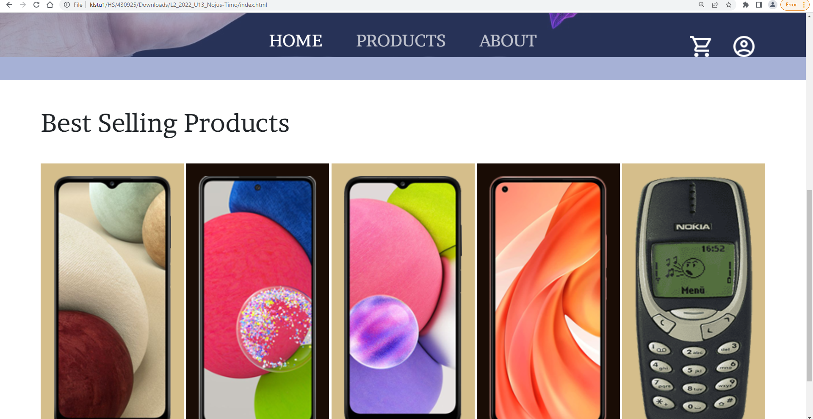
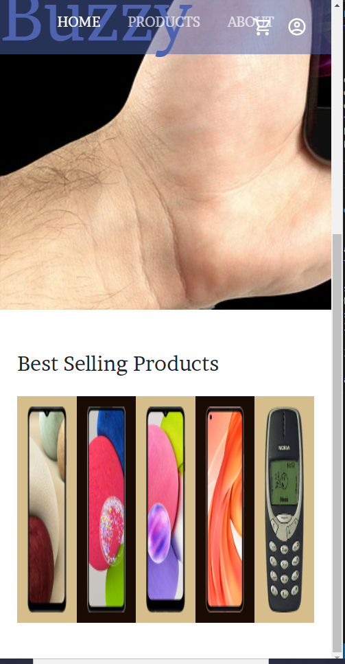

## Navigation 
# Markdown Table
### The table shows where you can go, it helps test the links to help people navigate to the correct location easily

| Start Location -->  | Home | Product | About | Content | Best selling |  Checkout | User| |
|---|---|---|---|---|---|---|---|---|
| Home | &check; | &check; | &check; | &check; |  &check; | &check; | &check; |
| Product | &check; | &check; | &check;  |  &check; |  | &check; | &check; |
| About | &check; | &check;  | &check; | &check;  |  | &check; | &check; |
| Content | &check; |  &check; |  &check; | &check; |  | &check; | &check; |
| Best selling | &check; |  &check; |  &check; |  &check; | &check; |  &check; | &check; |
| Checkout | &check; |  &check; |  &check; |  &check; | |  &check; | &check; |
| User | &check; |  &check; |  &check; |  &check; |  |  &check; | &check; |
# Test sheet

|   |  |
|---|---|
| Function of <b>all</b> links & hyperlinks | &check; | 
| Browser Compatability (Chrome, Edge, Firefox etc.) | &check; | 
| Website works with some errors on Mobile form | &check; |  
| Appearance at different resolutions | &check; |  
| Products have the correct details | &check; | 
| Video working in 2 or more websites | &check; | 
| Consult with collegues if they see anything out of the ordinary  | &check; | 
| Function of interactivities on range of browsers | &check; | 

# Website working on 2 or more browsers + Video working in 2 or more websites

# Images not stretching when zoomed in above 200%

* Note: the cart and user go through the contact button + Phones in the best selling squeeze each other stretching them upwards when in mobile form (i would make the navbar adjust size to fit everything without overlaping, and mobile phones resize when squeezed) 

* Note: Images in the "Best Selling Products" stretch when zoomed, Object fit: cover somewhat fixed that by keeping the image consistant but cutting the parts that spill out, currently have no idea how to fix that, i had object fit cover disabled as it cuts off the top and bottom part of nokia 3310

* Note: i would change the other phone specs into table but was pressed on time

* Note: The cards in the product section would have phone descriptions and redirect to their respective pages but was pressed on time